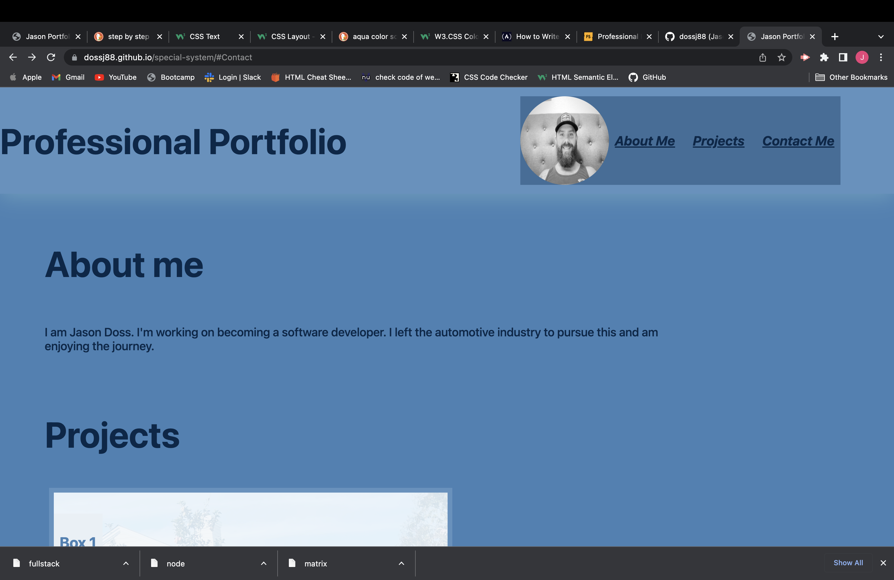
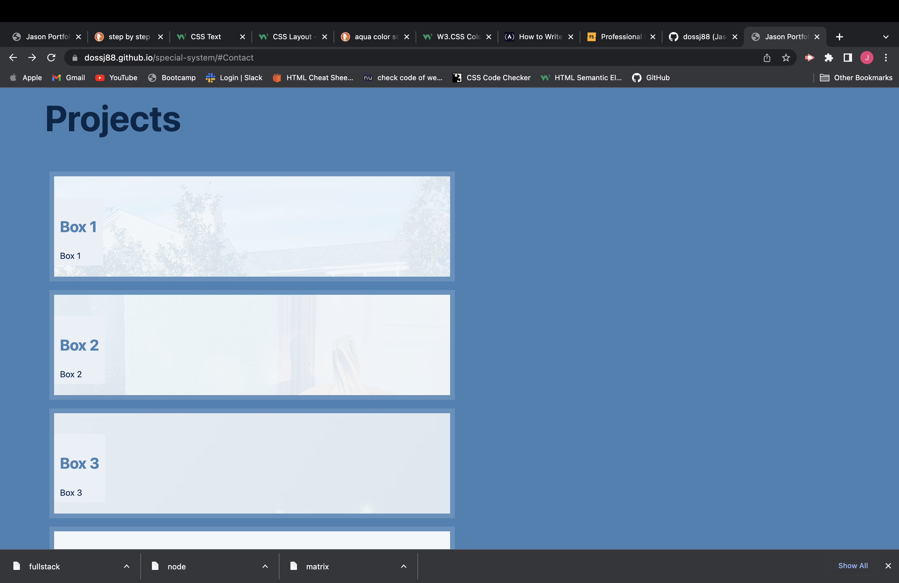
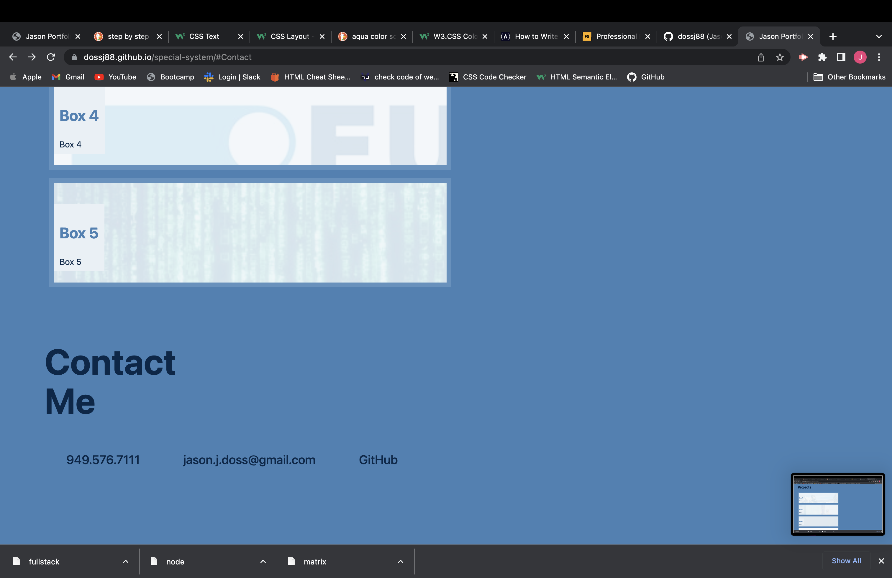

# <Special-System>

## Description

This was my first attempt at creating a portfolio website from the ground up. I wanted to understand how to use html and css more effiecently. This project is to show off my work to possible future employers. During this project I learned how to create a website. I had very little knowledge before I started. I learned how to use flex-wrap, media queries, and create every aspect of a website including sections, fonts, backgrounds, and more.

## Screenshots

## Website link

https://dossj88.github.io/special-system/

